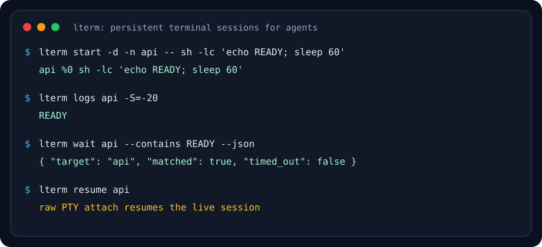

# Light Terminal (`lterm`)

[한국어](README.ko.md) | English | 🌐 [Browser-friendly HTML guide](https://ictechgy.github.io/light_terminal/)

## TL;DR

- **What** — A persistent terminal session daemon (like tmux, but smaller) with a tmux-compatible command layer for AI-agent tooling. Detach and reattach by name or pane id.
- **Who it's for** — Terminal-first coding agents such as Claude Code, Codex CLI, OpenCode, GitHub Copilot CLI, Cursor Agent, Antigravity/`agy`, Kiro, Jules, Aider, Goose, Amp, Crush, Kimi, Qwen, Gemini CLI, `oh-my-codex` / `oh-my-claude`, and users running them inside `cmux`.
- **How** — Use `lterm start` to create a session, `lterm resume` to reconnect, and `lterm agent <profile>` / `lterm claude` / `lterm codex` / `lterm opencode` / `lterm agy` / `lterm kiro` / `lterm gemini` for built-in shimmed agent launchers. Inside a tmux-enabled session, the `tmux` command resolves to `lterm tmux-compat`.
- **Status** — Alpha MVP with a documented 1.0 command/output compatibility boundary. It is a same-user convenience daemon — **not** a sandbox, an escape-sequence sanitizer, or a full tmux replacement.

---

`lterm` is intentionally smaller than tmux. It keeps long-running PTY sessions alive, lets clients detach and reattach at will, forwards terminal escape sequences unchanged, and translates the tmux command subset commonly used by terminal-first agent tooling.

> **Security model:** `lterm` is a same-user convenience daemon, not a sandbox. It rejects cross-user Unix-socket peers and uses owner-only runtime directories, but any process running as your OS user should be considered capable of controlling your sessions.
> See [SECURITY.md](SECURITY.md) for the full trust-boundary and audit policy details.
> Non-goals: see [docs/non-goals.md](docs/non-goals.md).

## Why lterm instead of plain tmux?

Use tmux when you want a full terminal multiplexer with rich pane/window/layout
management. Use `lterm` when you want the smaller surface that AI agents usually
need:

- **Agent-first persistence** — named PTY sessions keep running across detached
  clients without requiring every workflow to manage a full tmux server.
- **tmux-compatible where agents expect it** — `lterm tmux-compat` implements
  the command subset used by Claude Code, Codex CLI, OpenCode, GitHub Copilot
  CLI, Cursor Agent, Antigravity/`agy`, Kiro, Jules, Aider, Goose, Amp,
  Crush, Kimi, Qwen, Gemini CLI, OMX/OMC, and similar terminal-first tooling.
- **Raw attach, safe reports** — attached PTY streams remain raw for TUIs and
  interactive shells, while `logs`, `capture`, `compose`, `doctor`,
  `diagnose`, the `notify` fallback path, and other report surfaces strip
  terminal controls while preserving UTF-8 text such as Korean, CJK, and emoji.
- **cmux-friendly by design** — notifications and tmux shim calls are shaped for
  cmux/agent pane orchestration instead of generic desktop multiplexing.
- **Built-in observability** — `doctor` / `status`, bounded `logs --start/--end`,
  `wait` / `watch`, and `processes --orphans` make daemon, scrollback,
  completion, and subprocess state easy for humans or agents to inspect.

## Why this exists

The project addresses three constraints:

1. **tmux-like persistence and remote access** — sessions run inside a background daemon and can be attached or detached by name or pane id. Remote access is available through `lterm ssh` when `lterm` is installed on the remote host.
2. **cmux compatibility** — inside cmux, `lterm` preserves OSC notifications, exposes `lterm notify`, and opens tmux-shim worker panes as native cmux splits when possible.
3. **AI tooling support** — `lterm agent <profile>`, `lterm claude`, `lterm codex`, `lterm opencode`, `lterm copilot`, `lterm cursor-agent`, `lterm agy`, `lterm jules`, `lterm kiro`, `lterm aider`, `lterm goose`, `lterm amp`, `lterm crush`, `lterm kimi`, `lterm qwen`, `lterm gemini`, `lterm omx`, `lterm omc`, and `lterm install-shim` provide the fake `tmux` command plus the `TMUX` / `TMUX_PANE` environment variables that agent tools expect.

cmux compatibility is grounded in cmux's documented behavior: notifications via `cmux notify` and OSC 777 / OSC 99, a Unix-socket/CLI API for workspaces and splits, and tmux-shim commands that map into native cmux panes.

## Install

With Homebrew:

```bash
brew install ictechgy/tap/lterm
```

With npm on supported macOS/Linux platforms:

```bash
npm install -g @ictechgy/lterm
```

Homebrew and npm both install the `lterm` command on your `PATH`; verify with `lterm --version`.

Prefer an agent-assisted install? Copy the prompt in
[`docs/agent-install.md`](docs/agent-install.md) into Claude Code, Codex CLI,
OpenCode, GitHub Copilot CLI, Cursor Agent, Antigravity/`agy`, Kiro, Jules,
Aider, Goose, Amp, Crush, Kimi, Qwen, Gemini CLI, or another terminal coding
agent. It asks the agent to detect your platform, install `lterm`, verify it
with a smoke test, and avoid modifying shell startup files without showing you
the change.

For the 1.0 command/output stability boundary, see the
[public contract](docs/public-contract.md) and its machine-readable
[contract manifest](docs/contract-manifest.json).

With Cargo from GitHub, pin a release tag. The example below uses the current
README release; check the Releases page for newer tags:

```bash
cargo install --locked --git https://github.com/ictechgy/light_terminal --tag v1.0.24
```

Building from this checkout requires Rust 1.85 or newer:

```bash
cargo build --release --locked
./target/release/lterm --help
```

For local development:

```bash
cargo run -- --help
```

To expose the tmux shim:

```bash
lterm install-shim
# Add the printed directory to PATH ahead of the real tmux, or inspect and eval the helper:
lterm env
eval "$(lterm env)"
# fish:
lterm env --shell fish | source
# Optional: install supported AI CLI statusline/HUD badges.
lterm install-ai-statusline
```

## Quick start



**Create a persistent session and attach immediately:**

```bash
lterm start -n api -- npm run dev
```

**Create a detached session and attach later:**

```bash
lterm start -d -n api -- npm run dev
lterm resume api

# Compatibility names remain available:
lterm attach api
lterm a api
# `-a` goes right after `lterm`, separated from the target by a space.
lterm -a api
```

**Agent-terminal command vocabulary:**

| Task | General command | Compatibility names |
| --- | --- | --- |
| Start a persistent process | `lterm start -n api -- npm run dev` | `new` |
| Run a command with tmux compatibility enabled | `lterm run -- codex exec "summarize"` | None (`--no-tmux` opts out) |
| Open or create a session | `lterm open main` | `attach-or-new` |
| Resume an existing session | `lterm resume api` | `attach`, `a`, `-a` |
| Review an agent session in mobile scrollback | `LTERM_MOBILE=1 lterm resume codex-lterm` | Force with `--mobile`; force raw with `--raw` |
| List sessions | `lterm sessions` | `list`, `ls` |
| Inspect process trees | `lterm processes api --json --orphans` | `ps` |
| Rename a session | `lterm rename api api-renamed` | None |
| Set a session status theme | `lterm status-theme api green` | `theme` |
| Read sanitized scrollback | `lterm logs api --start=-80 --end=-1` | `capture` |
| Extract recent URLs from scrollback | `lterm urls api --last` | None |
| Record raw PTY output for debugging | `lterm trace api --duration 5s --output trace.jsonl` | `record` |
| Replay a trusted raw PTY trace | `lterm trace-replay trace.jsonl` | `replay-trace` |
| Open a sanitized scrollback composer for input | `lterm compose api` | `mobile` |
| Wait for session output or exit | `lterm wait api --contains READY --timeout 30s --json` | None |
| Watch a session and notify on completion | `lterm watch api --exit --notify` | None |
| Write input to a PTY | `lterm input api 'echo hello' --enter` | `send` |
| Stop a session | `lterm close api` | `kill` |
| Diagnose daemon and shim state | `lterm doctor --json` | `status` |
| Collect a redacted local diagnostic bundle | `lterm diagnose --bundle` | None |
| Inspect redacted local diagnostics | `lterm inspect --json` | None |
| Preview local setup steps | `lterm init --shell zsh` | None |
| Install supported AI CLI statusline badges | `lterm install-ai-statusline` | None |
| Install shell completions | `lterm install-completions --shell zsh` | None |
| Generate shell completions | `lterm completions zsh` | None |
| Run the background daemon explicitly | `lterm daemon` | None |
| Stop the daemon and all sessions | `lterm shutdown` | None |

Agent and shim utilities are also product CLI commands, not tmux aliases:

| Task | Product command | Compatibility boundary |
| --- | --- | --- |
| Launch a profiled agent session | `lterm agent claude -- --help` | Sibling shortcuts: `lterm claude`, `lterm codex`, `lterm opencode`, `lterm copilot`, `lterm cursor-agent`, `lterm agy`, `lterm jules`, `lterm kiro`, `lterm aider`, `lterm goose`, `lterm amp`, `lterm crush`, `lterm kimi`, `lterm qwen`, `lterm gemini`, `lterm omx`, `lterm omc` |
| Inspect available agent profiles | `lterm agents --json` | PATH availability probe at command runtime |
| Install the `tmux` compatibility shim | `lterm install-shim` | Creates a shim that forwards to `lterm tmux-compat` |
| Print shell exports for tmux compatibility | `eval "$(lterm env)"` (`lterm env --shell fish \| source` for fish) | Emits trusted shell setup that prepends the shim dir to `$PATH` |
| Install shell completions | `lterm install-completions --shell bash\|zsh\|fish` | Writes a user-local completion file and prints any activation hint; it does not start the daemon |
| Install AI CLI statusline badges | `lterm install-ai-statusline` | Installs supported statusline integrations; Claude/OMC gets an `lt:<session>:<pane>` command wrapper, while Codex is reported as skipped because its TUI does not yet accept custom `LTERM_SESSION` / `LTERM_PANE` statusline items |
| Generate shell completions | `lterm completions bash\|zsh\|fish` | Prints completion scripts only; it does not inspect sessions or start the daemon |
| Send a cmux-friendly notification | `lterm notify --title 'Done' --body 'Tests passed'` | OSC 777 fallback strips terminal controls while preserving Unicode text |
| Attach to a remote host | `lterm ssh user@host main` | Use trusted hosts; SSH handles host-key checks, and remote PTY bytes pass through without sanitization |
| Call the tmux shim namespace directly | `lterm tmux-compat list-commands` | Compatibility namespace, not a product alias table |

Use `eval "$(lterm env)"` only when you trust the `lterm` binary on your `PATH`.
It emits fixed `export` lines that prepend the shim directory to `$PATH`.
For fish, use `lterm env --shell fish | source` after the same trust check.
If you do not want to eval or source generated shell, run `lterm env` first and
copy only the export lines you expect into your shell startup file.

`lterm ssh` forwards remote PTY bytes to the local terminal without sanitizing
terminal control sequences, so a compromised remote can drive terminal features
that your local emulator permits: OSC 52 clipboard writes, OSC 8 hyperlinks,
window/title changes, cursor or screen manipulation, bracketed paste toggles, and
any emulator-specific escape handling. Treat it like direct `ssh` to a trusted
host and configure terminal features accordingly. "cmux-friendly" notification
means the fallback path emits the OSC 777 notification format that cmux watches.
The OSC 777 fallback sanitizer protects protocol framing; it does not normalize
Unicode bidi, format, or zero-width characters inside trusted title/body text.

Compatibility names are subcommands unless shown as a leading flag: `-a` is the legacy shortcut form and must be used as `lterm -a <target>`.

This table is the product CLI surface for humans and agents. `lterm tmux-compat ...` is a separate shim namespace for scripts that already speak tmux; not every product command has a tmux-compatible spelling. Use `lterm tmux-compat list-commands` to inspect the supported shim subset at runtime, and `lterm tmux-compat --version` when you only need the compatibility version banner.

`lterm sessions` hides child panes by default, preserves the original first five tab-separated columns (`name`, `pane`, `alive`, `cwd`, `command`), then appends attach state (`attached` / `detached`) and parent pane (`-` or a pane id). The JSON form also includes optional `agent_name` metadata for sessions launched through an agent profile; non-agent sessions omit that field. The compatibility names `lterm list` and `lterm ls` keep the same text output shape. Attached clients render a small status bar on the bottom row showing the current session and pane; the PTY is resized to the remaining rows. To force the older raw full-terminal resume, use `lterm resume --raw --no-status api` (or compatibility name `lterm attach --raw --no-status api`) or set `LTERM_ATTACH_MODE=raw`; add `LTERM_NO_STATUS=1` or `LTERM_STATUS=0` when only the status line conflicts with the client.

Row presence is separate from attach mode. `--attach-mode=auto` still chooses the raw-vs-mobile transcript transport only. On the raw attach path, ordinary sessions keep the row by default, while built-in agent launchers and later `resume` / `open` attaches to known agent sessions default to a full-height row-off surface. Direct agent launchers emit a compact terminal-title cue (`lt:<session>:<pane> · <agent>`) plus a one-shot `[lterm] <session> <pane> · <agent> (status row hidden for agent TUI; use --status to show it)` banner before attach when the terminal supports it; while attached row-off, lterm periodically refreshes only the title cue after idle gaps so Codex-like TUIs can overwrite their own title without losing the lterm identity. Set `LTERM_AGENT_CUE=0` to suppress both the terminal-title cue and banner, or `LTERM_AGENT_BANNER=0` to suppress only the inline banner while keeping the terminal-title cue. When a row-on shell session later appears to run a known agent command as a child process, lterm may best-effort suspend the row and restore full PTY height until that agent exits; ambiguous process detection fails safe by keeping the row. The global `LTERM_NO_STATUS=1` / `LTERM_STATUS=0` status kill-switches still win over CLI status requests.

Every lterm session also exports `LTERM_SESSION` and `LTERM_PANE` inside the child process. If you prefer a shell-prompt badge such as `[lterm:api:%0]`, add those variables to your shell prompt; `lterm init --shell zsh|bash|fish` prints this reminder along with the shim, completion, and AI statusline setup steps. AI CLIs that expose their own statusline or HUD should read these same variables and render the badge there instead of relying on lterm's host-side bottom row; this avoids fighting full-screen agent TUIs and mobile SSH renderers. Run `lterm install-ai-statusline` to install the supported integrations: it creates a Claude/OMC HUD wrapper that prepends `lt:<session>:<pane>` and backs up `~/.claude/settings.json` before changing it. For Codex, the installer leaves `~/.codex/config.toml` untouched and reports the integration as skipped: current Codex status_line items are built-in only, and `thread-id` is Codex-internal rather than an lterm session identifier.

`lterm resume` / `lterm open` use `--attach-mode=auto` (or `LTERM_ATTACH_MODE=auto`) by default. Accepted attach-mode values are `auto`, `raw`, and `mobile` (`mobile` means the normal-screen transcript view). Desktop clients still get the raw PTY attach path. Auto mobile detection is conservative best effort: `LTERM_MOBILE=1` or a Termius terminal identity marks the client as mobile, and the target must look like an agent session through persisted `LTERM_AGENT` metadata, a built-in `*-lterm` agent session name, or a known agent command basename. Some Termius SSH connections expose only generic SSH variables such as `SSH_TTY` and `TERM=xterm-256color`; auto mode intentionally treats those as raw unless you opt in with `--mobile`, `LTERM_ATTACH_MODE=mobile`, or `LTERM_MOBILE=1`. Scripts that need deterministic behavior should use explicit flags or env: `--raw` / `LTERM_ATTACH_MODE=raw` for the old raw path, or `--mobile` / `LTERM_ATTACH_MODE=mobile` for the transcript path. CLI flags take precedence over the environment. `--tail`, `--refresh`, and `--read-only` tune the transcript view.

`lterm rename <target> <new-name>` renames a running session without restarting its process. Renaming a session to its current name is a no-op success, while renaming over a different in-use name fails with a conflict error. `<target>` accepts a session name, session id, pane id (`%0`), or bare pane number (`0`); a bare numeric target is interpreted as a pane number because session names cannot be all digits. `<new-name>` follows the same syntax rules as `--name`.

`lterm status-theme <target> <theme>` (alias: `lterm theme`) stores a per-session status bar theme without restarting the PTY; pane ids resolve to their session. Use `default`, `clear`, or `none` to remove the session override and return to the attaching client's default. Already-attached clients keep their current status color until they detach and reattach. New sessions can set the same metadata at creation time with `lterm start --status-theme green -n api -- npm run dev` (or alias `--status-color`).

`lterm doctor` (compatibility name: `lterm status`) reports client/daemon versions, protocol compatibility, runtime/data/socket/shim paths, whether the shim directory is on `PATH`, and a count plus boolean/null `tmux_compat` summary. It does not start the daemon; `daemon_reachable=no` / `false` means no compatible daemon answered on the current socket. Normal client operations warn on stderr when a reachable daemon reports a different lterm or protocol version, which usually means an old daemon survived a binary upgrade.

`lterm diagnose --bundle` prints a local-only JSON diagnostic bundle for issues
and agent handoffs. It includes `doctor` data, redacted environment presence
flags, and — only when an existing daemon is reachable — session metadata plus
process rows. It does not start the daemon and does not include raw PTY bytes or
scrollback by default. `lterm inspect --json` prints the same redacted bundle for
tools that expect an inspect-style JSON entrypoint; it requires `--json`.

`lterm logs <target>` accepts `--start` / `-S` and `--end` / `-E` line offsets. Non-negative values are absolute scrollback line indexes; negative values count back from the current scrollback line count. `--end` is inclusive, so `lterm logs api -S0 -E0` captures only the first line. Capture output remains sanitized text: terminal controls are removed, while UTF-8 text such as Korean, CJK, and emoji is preserved. Attached PTY streams remain raw.

`lterm trace <target> --duration 5s --output trace.jsonl` records raw PTY
output chunks to a private local JSONL file with timestamps and hex-encoded
bytes. It is for opt-in debugging of intermittent render issues; the recorder
only writes the JSONL artifact, caps raw capture at `--max-bytes` (default
16 MiB), and refuses to overwrite existing trace files unless `--force` is
passed. To replay, use `lterm trace-replay <file>` only with traces you trust:
it validates the whole JSONL file before emitting any raw terminal bytes and
caps replay at the default trace capture size plus a per-trace chunk-count
limit.

`lterm wait <target> --exit / --contains <text>` blocks until a session exits or its sanitized scrollback contains a marker. Add `--timeout 250ms|2s|5m|1h`, `--tail N`, and `--json` for automation-friendly health checks. On timeout, `wait` / `watch` return exit code `124` and JSON reports `timed_out: true`. `lterm watch` uses the same conditions and can add `--notify` to emit a cmux-friendly completion notification without altering attached PTY bytes; with `--json`, stdout stays machine-readable even when notification fallback is needed.
Oversized `--contains` needles are rejected with an explicit error, and the
daemon caps concurrent blocking `wait` / `watch` checks so automation cannot fan
out unbounded waiters.

Set `LTERM_STATUS_STYLE=full` or `LTERM_STATUS_STYLE=minimal` to choose the visual style. `full` (default for local terminals) draws a colored bar; `minimal` drops all SGR colors in favor of plain text. SSH sessions (detected via `SSH_CONNECTION`, `SSH_CLIENT`, or `SSH_TTY`) and Termius-style clients (detected via terminal identity variables) default to `minimal` to avoid mobile color-mapping issues, unless a session or environment theme is explicitly set.

Set `LTERM_STATUS_THEME=blue|green|magenta|cyan|amber|red|gray|plain` to change the default colored status bar for the attaching client. Per-session overrides win over the environment: `lterm start --status-theme amber -n api -- npm run dev`, `lterm run --status-color cyan -- cargo test`, or `lterm status-theme api plain`. If you export this variable from shell startup files, it also opts SSH attaches into colored status bars; leave it unset or set `LTERM_STATUS_STYLE=minimal` on mobile SSH clients that need plain text. Theme names are parsed from a fixed allowlist; lterm never injects arbitrary user-provided terminal escape sequences into the status row.

### Status bar customization

Status bar themes were added in v0.1.3. They are metadata-only: changing a theme never restarts the PTY, never changes the attached PTY byte stream, and never accepts arbitrary terminal escape sequences from user input.

Use the narrowest scope that matches what you want:

| Scope | Example | When to use it |
| --- | --- | --- |
| New session | `lterm start --status-theme green -n api -- npm run dev` | Keep a service or agent session recognizable across future attaches. |
| Existing session | `lterm status-theme api amber` | Recolor a running session without restarting its process. |
| Agent launcher session | `lterm codex --status --status-color cyan -- exec "summarize"` | Give an agent-owned session a persistent color while preserving launcher controls. |
| Attaching client default | `export LTERM_STATUS_THEME=magenta` | Change the default for sessions that do not have their own override. |
| Plain/minimal clients | `export LTERM_STATUS_STYLE=minimal` | Prefer text-only status on mobile SSH clients or terminals with fragile color mapping. |

Allowed themes are intentionally fixed:

| Theme | Good fit |
| --- | --- |
| `blue` | Default local status bar. |
| `green` | Long-running services or healthy/background tasks. |
| `magenta` | Agent or review sessions you want to spot quickly. |
| `cyan` | Build/test/dev-tool sessions. |
| `amber` | Watch/diagnostic sessions that need attention. |
| `red` | Risky, destructive, or production-adjacent sessions. |
| `gray` | Low-priority background sessions. |
| `plain` | No colored bar; useful when ANSI colors are distracting but the status row is still helpful. |

Reset a session override with `lterm status-theme api default` (or `clear` / `none`). Already-attached clients keep their current rendered color until detach/reattach, so scripted changes are safe to apply while a human is attached.

When the attached PTY enters the alternate screen buffer (e.g. `vim`, `less`, `htop` via `\x1b[?1049h`), lterm suspends its status bar to avoid conflicting with the application's UI. The status bar is redrawn immediately when the application exits alt-screen.

If `lterm resume` / `lterm attach` panics or exits unexpectedly and reaches lterm's recovery hook, it emits a minimal best-effort recovery sequence (scroll region reset, cursor visible, alt-screen exit, SGR reset) so the user's terminal is less likely to be left in raw mode or with a hidden cursor.

Session names containing CJK characters or emoji (including ZWJ families, country flags, and combining marks) are aligned by display width using `unicode-width` and `unicode-segmentation`, so the status bar stays correctly padded across mixed-width content.

When a child application enables the Kitty keyboard protocol through `CSI u` enhancement sequences, lterm tracks that and makes a best-effort attempt to restore the terminal keyboard mode when attach exits so a crashed child does not leave later shell input looking like `1;1:3u` escape fragments.

**Inspect or control a session:**

`--children` includes managed child panes; `--all` includes sessions that are normally hidden from the default list.

```bash
lterm sessions
lterm sessions --children
lterm sessions --all
lterm processes api --orphans
lterm logs api --start=-80 --end=-1
lterm urls api --last
lterm search api 'build failed'
lterm compose api
LTERM_MOBILE=1 lterm resume codex-lterm
lterm resume --raw codex-lterm
lterm wait api --contains READY --timeout 30s --json
lterm watch api --exit --notify
lterm input api 'echo hello' --enter
```

The generic aliases above are meant for day-to-day agent-terminal use: `sessions` lists persistent work, `processes` inspects child process trees, `logs` reads sanitized scrollback, `compose` shows sanitized scrollback with a fixed bottom prompt for committing text, mobile transcript attach gives phone clients native scrollback for long agent output, `wait` / `watch` make marker-or-exit conditions observable for scripts and agents, and `input` writes text to the target PTY. `lterm mobile` is a visible alias for `lterm compose`; separately, the `--mobile` attach flag selects the normal-screen transcript attach path. The compatibility names `list` / `ls`, `ps`, `capture`, and `send` remain available for scripts and muscle memory.

`lterm urls <target>` extracts `http://` and `https://` links from the last
120 sanitized scrollback lines without touching the raw attached PTY stream.
Default output is `N<TAB>URL`, one link per line; `--last` prints only the
newest valid URL occurrence for phone-friendly copy/paste, `--json` emits a
JSON array, and `--tail N` changes the scan range. Empty text modes exit
successfully with no output, while JSON mode prints `[]`. Extraction is bounded
to 256 unique ASCII URL tokens and skips raw URL candidates longer than 4096
bytes instead of truncating them. In mobile transcript mode, type `/links` or
`/urls` to show the same numbered list locally instead of sending that text to
the PTY. This is useful for Claude/OAuth login URLs on Termius-style mobile SSH
clients; for Claude-specific mobile control, Claude Code's Remote Control flow
can also reduce URL-copy round trips.

Treat extracted links as untrusted terminal output. A malicious program can
print phishing URLs, and OAuth, magic-login, or device-code links may carry
short-lived secrets. Open only links you expect, avoid pasting them into shared
logs or chat, and prefer `--last` only when you know the newest link is the one
you intend to use.

`lterm search <target> QUERY` searches the last 120 sanitized scrollback lines
for case-sensitive literal matching lines without touching the raw attached PTY
stream. Default output is `N<TAB>LINE` with 1-based numbering; `--json` emits a
JSON array of the same sanitized matching lines, `--tail N` changes the scan
range, no-match text mode exits successfully with no output, and an empty
`QUERY` is rejected. In mobile transcript mode, type `/grep QUERY` to show
matching lines from the active transcript tail window locally instead of sending
that text to the PTY; `/grep` without a query prints `Usage: /grep QUERY`, and
if nothing matches it prints `No matches found in current transcript.`

For automation and tests, `lterm compose api --once --message 'hello'` performs one sanitized capture/send cycle. It captures the last `--tail` sanitized lines (default: 80) from the same session-or-pane target model as `logs`, then appends Enter (`\r`) by default, matching `lterm input --enter`; add `--no-enter` to send the exact message bytes. `compose` / `mobile` is not an attach client and does not change attached-client counts or PTY geometry.
In interactive compose, the view refreshes on `--refresh` (default: 500ms) and after local input or resize events. Pressing Enter commits the current input buffer (empty buffers are committed too) and appends `\r` by default, matching the one-shot rule above. Ctrl-C, Ctrl-D, and Esc exit the local composer instead of forwarding to the PTY.
`lterm compose api --transcript` opens the same normal-screen transcript UI used by mobile auto attach. It is useful when you want sanitized scrollback and simple line input without the alternate-screen composer; add `--read-only` when you only want to watch output. Transcript-local commands include `/refresh`, `/raw`, `/links` / `/urls`, `/grep QUERY`, and `/exit` / `/quit`; `/links`, `/urls`, and `/grep` are handled locally and are never forwarded to the PTY. When no links are present they print `No URLs found in current transcript.`; `/grep` uses the active transcript `--tail` window and prints `Usage: /grep QUERY` when no query is provided; when no `/grep` lines match it prints `No matches found in current transcript.`; unrecognized lines are sent to the PTY.

**Stop a session:**

```bash
lterm close api
```

`kill` is a visible compatibility alias for `close`; both names use the same session/pane termination path.

**Run the daemon explicitly (advanced):**

```bash
# Client commands start this on demand; run it directly for supervisors/debugging.
lterm daemon
```

**Stop the daemon and every session it owns:**

```bash
# This is daemon-wide, not a single-session close.
lterm shutdown
```

## AI workflows

**Run common agent CLIs inside shimmed sessions:**

```bash
lterm claude
lterm codex
lterm opencode
lterm copilot
lterm cursor-agent
lterm agy -- -p "summarize this repo"
lterm kiro
lterm jules
lterm aider
lterm goose
lterm amp
lterm crush
lterm kimi
lterm qwen
lterm gemini -- -p "summarize this repo"  # Gemini CLI also accepts -p
lterm agents
```

These are thin profile aliases — for example:

```bash
lterm agent claude
lterm agent codex
lterm agent opencode
lterm agent cursor-agent
lterm agent agy -- -p "summarize this repo"
lterm agent qwen
lterm agent gemini -- -p "summarize this repo"
```

Agent launchers accept the same session controls across built-in profiles and custom `lterm agent <profile>` launches:

```bash
lterm claude --name repo-review --cwd /path/to/repo
lterm codex --detach --name repo-codex -- exec "summarize this repo"
lterm codex --mobile --tail 200 --refresh 1s --read-only
lterm agy --status -- -p "keep lterm status visible"
```

Known Claude/Codex/OpenCode/Copilot/Cursor Agent/Antigravity/Kiro/Jules/Aider/Goose/Amp/Crush/Kimi/Qwen/Gemini/OMX/OMC profiles default to the `auto` attach policy. On desktop, that means a raw full-terminal attach without the lterm status bar, so the agent's own TUI, status, and alternate-screen rendering stay in control. Reattaching those agent sessions later with `lterm resume` or `lterm open` keeps the same row-off default. On Termius-style mobile clients, `auto` uses the normal-screen transcript described above so long agent output can be reviewed with native mobile scrollback. Use `--raw` to force raw attach, `--mobile` to force transcript attach, `--status` to request the lterm status bar on the raw path during direct agent launch, or `--no-status` to suppress it for any raw launch/profile that would otherwise show it. `--status` is intentionally a best-effort override for agent debugging and can still conflict with agent TUIs; `--mobile --status` does not create a raw status row because mobile transcript owns its own UI. Put `--` before agent arguments that could be parsed as lterm launch options. `lterm agent <name>` also works for any safe bare command name available in `PATH` (for example `lterm agent qwen-code`); use `lterm run -- <command>` only when you want the lower-level tmux-compatible primitive directly.

Agent launchers also keep host/application color policy separate from the agent child. Ambient `NO_COLOR`, `FORCE_COLOR`, `CLICOLOR`, and `CLICOLOR_FORCE` from the client or long-lived daemon are not forwarded to sessions marked with `LTERM_AGENT`, because mobile SSH or host status preferences can otherwise force full-screen agent TUIs into monochrome output. Ordinary non-agent sessions (`lterm start` / `lterm new` / `lterm run`) still preserve those variables for child processes, and lterm's own status style continues to honor `NO_COLOR`.

Launcher controls are long-only (`--name`, `--cwd`, `--detach`, `--status`, `--no-status`, `--status-theme`, `--status-color`, `--attach-mode`, `--raw`, `--mobile`, `--tail`, `--refresh`, `--read-only`) so common agent short flags such as `-c` pass through naturally. They apply uniformly to built-in agent shortcuts such as `claude`, `codex`, `opencode`, `copilot`, `cursor-agent`, `agy`, `kiro`, `jules`, `aider`, `goose`, `amp`, `crush`, `kimi`, `qwen`, `gemini`, `omx`, `omc`, and `agent <profile>`. Use `--status-theme` / `--status-color` on agent launches when you want that session to keep a specific lterm status color across future attaches.
`--detach` prints `name<TAB>pane<TAB>command` with control characters and Unicode line/paragraph separators in each field replaced by spaces; resume later with `lterm resume <name>` or compatibility name `lterm attach <name>`. The detach record does not echo `--cwd`; query the session if you need to inspect it later.
Explicit `--name` values use lterm's normal session-name syntax and must not already be in use; they do not auto-suffix on conflict, so an in-use name fails with a conflict error.
Names may contain ASCII letters, digits, `.`, `_`, and `-`, must not start with `-` or `%`, must not consist only of digits, must not look like a UUID, and are limited to 128 bytes.
Use `lterm agents` (or `lterm agents --json`) to inspect profile defaults and whether their binaries are currently available in `PATH`. JSON rows use `kind` values of:

- `built-in` for profiles shipped by lterm, such as `claude`, `codex`, or `kiro`;
- `custom` for safe bare commands discovered from the names you request; and
- `configured` for profiles loaded from an explicit `--agent-config` file.

Pass profile names, such as `lterm agents codex my-agent --json`, to inspect a selected built-in/custom/configured set; availability is a point-in-time PATH probe. Built-ins resolve the binary names shown by `lterm agents`; most match the profile name, while `kiro` resolves `kiro-cli`. If a provider installs a different command name, use `lterm agent <command>` or a configured profile rather than relying on a guessed alias.
For reusable custom aliases, pass an explicit JSON config file:

```bash
cat > agents.json <<'JSON'
{ "profiles": [{ "name": "repo-review", "binary": "codex", "session_base": "repo-review-session", "status_default": false }] }
JSON
lterm agents --agent-config agents.json --json
lterm agent repo-review --agent-config agents.json -- exec "review this repo"
```

Configured names and binaries use the same safe profile syntax as `lterm agent <profile>`; built-in names cannot be redefined.
Configured profile rules:

- `binary` must be a bare command name resolved from `PATH`, not a shell fragment or path.
- `binary` defaults to `name`.
- `session_base` defaults to `<name>-lterm`.
- `status_default` defaults to `true` and must be a boolean when present.
- duplicate names and unknown JSON fields are rejected.
- when `--agent-config` is supplied, non-built-in selected names must exist in that file.

**Run Oh My Codex inside a shimmed session:**

```bash
lterm omx team
# Extra omx flags are passed through, e.g.:
lterm omx --madmax --xhigh
```

**Run Oh My Claude similarly:**

```bash
lterm omc team
# The OMC builds tested here reject --xhigh — use --madmax alone unless your
# installed `omc --help` explicitly lists --xhigh.
lterm omc --madmax
```

**Run any command with tmux compatibility enabled:**

```bash
lterm run -- omx hud --tmux
lterm run -- claude
lterm run -- codex exec "summarize the repository"
```

Inside that session, `tmux` resolves to the `lterm tmux-compat` shim. This is a compatibility layer, not a second spelling of every `lterm` product command. The shim implements the command subset most AI orchestration scripts rely on:

- **Sessions** — `new-session`, `new-window`, `attach-session`, `has-session`, `list-sessions`, `rename-session`, `kill-session`
- **Queries** — `list-windows`, `list-clients`, `list-commands`, `show-options`, `show-window-options`
- **Panes** — `split-window`, `list-panes`, `display-message`, `capture-pane`, `send-keys`, `kill-pane`, `resize-pane`
- **Buffers / popups** — `display-popup`, `wait-for`, `load-buffer`, `save-buffer`, `paste-buffer`
- **No-op compatibility** — `select-pane`, `select-layout`, `set-hook`, `set-option`, `set-window-option`, `set-environment`, `show-environment`

Compatibility notes: lterm models each root session as one pseudo-window
(`window_index=0`, `window_panes=1`). `client_pid` and `client_tty` expand to
empty strings because lterm does not expose per-client process or TTY metadata.
`#{history_size}` currently expands to `0`, which keeps tmux-format consumers
numeric even though lterm does not expose a tmux-style pane history length yet.
tmux `-f` filters are intentionally rejected instead of being silently ignored.
`set-hook` accepts hook set/unset forms used by agent runtimes such as OMX
`client-resized[...]` handlers, but lterm does not run a tmux hook dispatcher.
Detached `split-window -d -t <target>` accepts any existing live lterm target,
matching tmux's cross-pane helper launch behavior inside the same daemon socket;
the daemon verifies same-OS-user peer credentials before honoring requests, and
the detached helper is created as a separate lterm session rather than being
attached into the target pane. `split-window -b -h` and `split-window -b -v` map
to cmux `left` and `up` placements respectively when a visible cmux split is
created. Detached `new-window -d` / `neww -d` is intentionally partial: it creates
a standalone lterm helper session, supports tmux-style `-P`/`-F` target printing,
and rejects attached-window mode instead of silently changing the current pane.
Use `lterm tmux-compat list-commands --verbose` for tab-separated `command`,
alias, support tier, and usage fields, or `--json` for machine-readable rows.
Support tiers are `full`, `partial`, and `noop` within lterm's compatibility
boundary. Set `LTERM_DEBUG_TMUX=1` to emit an opt-in stderr diagnostic row when
an unsupported tmux command reaches the shim.

Status bar redraws use xterm SGR stack controls only on conservatively allowlisted terminal clients (for example xterm/iTerm2/WezTerm identities) to avoid stealing the foreground/background color state of the running TUI. Set `LTERM_STATUS_SGR_STACK=0` to disable `CSI # {` / `CSI # }`; set it to `1` to force the stack after verifying your client supports or safely ignores those private CSI sequences. Kitty, Alacritty, Ghostty, Termius, and generic `TERM=xterm-*` values stay opt-in until their SGR-stack behavior is verified.

When lterm mirrors session identity into cmux understatus pills, it probes `cmux set-status --help` without mutating cmux state. Builds that advertise `--label` receive labeled status rows; older cmux builds keep working because lterm omits the unsupported flag.

## cmux behavior

When `lterm tmux-compat split-window` detects cmux (via `CMUX_WORKSPACE_ID`, `CMUX_SURFACE_ID`, or a cmux socket), it:

1. Starts a new `lterm` PTY session for the worker command.
2. Asks cmux to create a native split (`cmux new-split right/down`, or `left/up` for tmux backward splits).
3. Sends the compatibility command `lterm attach <pane>` into that split. If a safe absolute executable is supplied through `LTERM_BIN`, lterm uses it; otherwise it falls back to the current executable. The compatibility command keeps cmux panes working even with older builds that predate `resume`.

This gives cmux a real pane to decorate while `lterm` retains scrollback capture, `send-keys` compatibility, and safe status-label fallback behavior across cmux versions.

**Notifications:**

```bash
lterm notify --title 'Task complete' --body 'All checks passed'
```

`lterm notify` first tries `cmux notify`. If that's unavailable, it emits OSC 777 so cmux or another compatible terminal can still surface the notification. Notification fields are stripped of terminal control characters before falling back to OSC; subtitle/body separators such as newlines are replaced with spaces rather than emitted verbatim, which keeps the OSC 777 framing intact.

For agent workflows, prefer `lterm watch <target> --exit --notify` or `lterm watch <target> --contains DONE --notify` when the notification should be tied to a specific session condition.

## Remote access

If `lterm` is installed on a remote machine:

```bash
lterm ssh user@host main
```

This uses the same attach-or-create behavior as `lterm open main` on the remote host; the wire command remains `lterm attach-or-new main` so newer local clients still work with older remote `lterm` installs that do not know `open`. Pass SSH flags after `--`:

```bash
lterm ssh devbox main -- -p 2222 -i ~/.ssh/id_ed25519
```

## Architecture

- **Daemon** — one Unix socket per user under `$XDG_RUNTIME_DIR`, with an owner-only fallback under `/tmp`.
- **PTY sessions** — spawned via `portable-pty`, backed by ring-buffer scrollback.
- **Attach protocol** — the CLI sends JSON over the Unix socket, optionally reserves the bottom row for a local status bar, then streams PTY bytes.
- **tmux shim** — a small shell script named `tmux` forwards commands to `lterm tmux-compat`.
- **cmux bridge** — optional; uses the cmux CLI when detected.

After upgrading the `lterm` binary, restart any already-running daemon before
relying on newly added wire-protocol behavior; existing daemon processes keep
the old code until they are stopped.

## Security notes

**Terminal output is forwarded as-is.** `lterm resume` (compatibility name: `lterm attach`) passes PTY bytes through so full-screen terminal programs and cmux/OSC notifications keep working. The local status bar is purely a client-side decoration; use `--no-status` for a fully raw terminal surface. Any nested-agent row suspension is host-side geometry/status management only and does not sanitize or rewrite attached PTY bytes. Untrusted child programs can still emit terminal escape sequences to an attached terminal — exactly as under tmux/screen. **Do not use `lterm` as an escape-sequence sanitizer or sandbox.**

**Capture output is terminal-control-sanitized before display/logging.** `lterm logs` (compatibility name: `lterm capture`), `lterm compose` (alias: `lterm mobile`), and `tmux capture-pane` strip terminal control sequences, including raw or UTF-8-encoded C1 controls, before printing scrollback. Valid UTF-8 text such as Korean, CJK, and emoji is preserved. Scrollback text can still be untrusted program output, so review it before feeding it to humans or agents. `compose` is a non-attached view that commits text through the existing input/send path; it does not transform raw attached PTY streams.

**Process visibility.** `lterm processes [session]` (or compatibility name `lterm ps [session]`) shows the process tree rooted at each session child, including process-group ids. Add `--orphans` to also include same-process-group rows that are no longer descendants of the recorded session root, so long-running Codex/OMX/MCP subprocess buildup stays visible before it becomes a memory-leak surprise. The system `ps` is invoked by absolute path, and malformed process rows are skipped rather than guessed at.

**Socket location.** Custom `LTERM_SOCKET` paths must live in an owner-only directory. Prefer `LTERM_RUNTIME_DIR` when you need an isolated socket location.

**Binary override.** `LTERM_BIN` is a trusted developer override for child
`lterm` invocations such as cmux split attach commands. Overrides are accepted
only when they are absolute paths to executable regular files and contain no
control characters; invalid values are ignored in favor of the current
executable or `lterm` on `PATH`. Do not set it from untrusted environment data.

**Popup commands.** `tmux-compat display-popup` runs the requested command through the user's shell to preserve tmux-like behavior. **Do not pass untrusted popup commands.**

**Build reproducibility.** Use the committed lockfile for release builds: `cargo build --release --locked`. The current lockfile pins `serde_json 1.0.159` and its registry dependency `zmij 1.0.21`; both are resolved by Cargo from the lockfile, not vendored locally. Verify the dependency set with `cargo tree --locked -p serde_json`.

## Current limitations

- Session persistence lasts only while the daemon and host are alive — reboot/process-state restore is not implemented.
- Outside cmux, `split-window` creates additional managed PTY sessions but does not draw a tiled in-terminal UI.
- This is a compatibility subset, not a full tmux server. Scripts using advanced tmux formats, hooks, layouts, or options may need additional shim commands.
- cmux pane capture is handled through `lterm` sessions, not cmux scrollback APIs.
- The daemon authenticates local clients via OS peer credentials and owner-only socket paths — there are no per-session ACLs yet.
- Session shutdown uses verified process-group signaling, so child trees like `shell → OMX → Codex → MCP` are cleaned up together when possible. Processes that intentionally detach into a different session/process group can outlive `lterm close` / `lterm kill`; inspect them with `lterm processes` / `lterm ps` or OS process tools.

## Development

```bash
cargo fmt
cargo clippy --all-targets -- -D warnings
cargo test
cargo build --release --locked
```

If a system package-manager Rust toolchain fails before Cargo starts (for
example a Homebrew `libLLVM.dylib` loader error), prefer the rustup toolchain in
your shell before running release gates:

```bash
PATH="$HOME/.cargo/bin:$PATH" rustc -vV
PATH="$HOME/.cargo/bin:$PATH" cargo --version
```

Use isolated runtime directories for manual testing:

```bash
TMP=$(mktemp -d)
LTERM_RUNTIME_DIR="$TMP/run" LTERM_DATA_DIR="$TMP/data" cargo run -- start --name test -- sh -lc 'echo hi; sleep 10'
LTERM_RUNTIME_DIR="$TMP/run" LTERM_DATA_DIR="$TMP/data" cargo run -- logs test -S=-20
LTERM_RUNTIME_DIR="$TMP/run" LTERM_DATA_DIR="$TMP/data" cargo run -- shutdown
```

Release/contract preflight helpers:

```bash
PATH="$HOME/.cargo/bin:$PATH" scripts/release-preflight.sh --contract-only
PATH="$HOME/.cargo/bin:$PATH" scripts/release-preflight.sh --allow-occupied-skip --skip-audit
scripts/dependency-minor-dry-run.sh
```

Use `--run-soak` on `scripts/release-preflight.sh` only for the manual
release-gate soak profile. Use
[`docs/release-evidence-template.md`](docs/release-evidence-template.md) to
capture release, toolchain provenance, audit, contract, dependency, and soak
evidence before tagging or publishing.

## License

Licensed under either of:

- Apache License, Version 2.0 ([LICENSE-APACHE](LICENSE-APACHE))
- MIT License ([LICENSE-MIT](LICENSE-MIT))

at your option.
